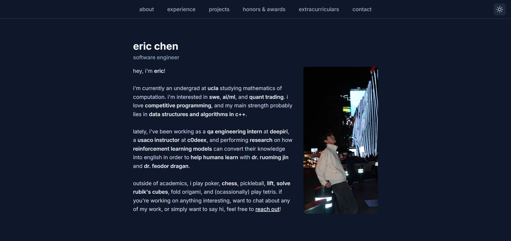

<h2 align="center">
  hi, i'm eric!
</h2>

  i'm currently studying <strong>mathematics of computation</strong> at ucla. i'm interested in <strong>software engineering</strong>, <strong>ai/ml</strong>, and <strong>quant trading</strong>. 
  i'm also passionate about <strong>competitive math</strong> and <strong>programming.</strong> 
  feel free to [reach out](https://www.linkedin.com/in/eric-chen-ucla/)!

<h2 align="center">
 my portfolio website:  
</h2>

<!--

## github stats

-->

